# Database Table Relations

This document provides a visual representation of the database schema and relationships using Mermaid.js.

```mermaid
erDiagram
    TENANTS ||--|| TENANT_SETTINGS : "has"
    TENANTS ||--o{ USERS : "contains"
    TENANTS ||--o{ ROLES : "defines"
    TENANTS ||--o{ POSITIONS : "defines"
    TENANTS ||--o{ SUBSCRIPTIONS : "has"
    TENANTS ||--o{ INVOICES : "receives"
    TENANTS ||--o{ PROJECTS : "manages"
    TENANTS ||--o{ WORK_SHIFTS : "configures"
    TENANTS ||--o{ CALENDAR_EVENTS : "schedules"
    
    SUBSCRIPTION_PLANS ||--o{ SUBSCRIPTIONS : "defines"
    
    ROLES }o--o{ PERMISSIONS : "role_permissions"
    
    USERS }o--|| TENANTS : "belongs to"
    USERS }o--|| ROLES : "has"
    USERS }o--|| POSITIONS : "assigned"
    USERS |o--o| USERS : "reports to (manager_id)"
    USERS |o--o| USERS : "delegates to (delegate_id)"
    USERS ||--o{ ATTENDANCES : "records"
    USERS ||--o{ LEAVES : "requests"
    USERS ||--o{ OVERTIMES : "requests"
    USERS ||--o{ PAYROLLS : "receives"
    USERS ||--o{ EXPENSES : "claims"
    USERS ||--o{ PERFORMANCE_GOALS : "tracks"
    USERS ||--o{ APPRAISALS : "reviewed"
    USERS ||--o{ LEAVE_BALANCES : "has"
    USERS ||--|| USER_PAYROLL_PROFILES : "has"
    USERS ||--o{ RECENT_ACTIVITIES : "performs"
    USERS ||--o{ PROJECT_MEMBERS : "is member of"
    USERS ||--o{ TIMESHEET_ENTRIES : "logs"

    LEAVES }o--|| LEAVE_TYPES : "type"
    LEAVE_BALANCES }o--|| LEAVE_TYPES : "type"
    
    PROJECTS ||--o{ PROJECT_MEMBERS : "has"
    PROJECTS ||--o{ TASKS : "has"
    PROJECTS ||--o{ TIMESHEET_ENTRIES : "logged in"
    
    TASKS ||--o{ TIMESHEET_ENTRIES : "tracked by"
    
    APPRAISALS }o--|| PERFORMANCE_CYCLES : "part of"
    
    USER_CHANGE_REQUESTS }o--|| USERS : "requested by"
    USER_CHANGE_REQUESTS }o--|| TENANTS : "belongs to"
    
    PROVISIONING_TICKETS }o--|| TENANTS : "for"
    SUPPORT_MESSAGES }o--|| TENANTS : "from"
    SUPPORT_MESSAGES }o--|| USERS : "written by"
```

## Description of Key Entities

### Core Identity
- **TENANTS**: Represents a company or organization using the SaaS.
- **USERS**: Individual employees within a tenant.
- **ROLES & PERMISSIONS**: RBAC system controlling access to modules.
- **POSITIONS**: Job titles and hierarchy levels.

### Operations
- **ATTENDANCES**: Clock-in/out records with GPS and media.
- **LEAVES**: Absence requests and balances.
- **OVERTIMES**: Extra work hour requests.
- **PAYROLLS**: Monthly salary calculations (Draft/Published).

### SaaS & Billing
- **SUBSCRIPTIONS**: Link between a Tenant and a Subscription Plan.
- **SUBSCRIPTION_PLANS**: Global plans (Trial, Starter, Business, etc.) defining feature access and limits.
- **INVOICES**: Billing records for tenant subscriptions.

### Projects & Productivity
- **PROJECTS**: High-level initiatives managed by tenants.
- **TASKS**: Specific work items within a project.
- **TIMESHEET_ENTRIES**: Daily logs of work hours spent on tasks/projects.

### Performance & HR
- **PERFORMANCE_GOALS**: KPIs or OKRs for users.
- **APPRAISALS**: Periodic performance reviews within a cycle.
- **USER_CHANGE_REQUESTS**: Approval workflow for profile updates.
