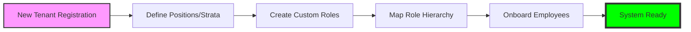
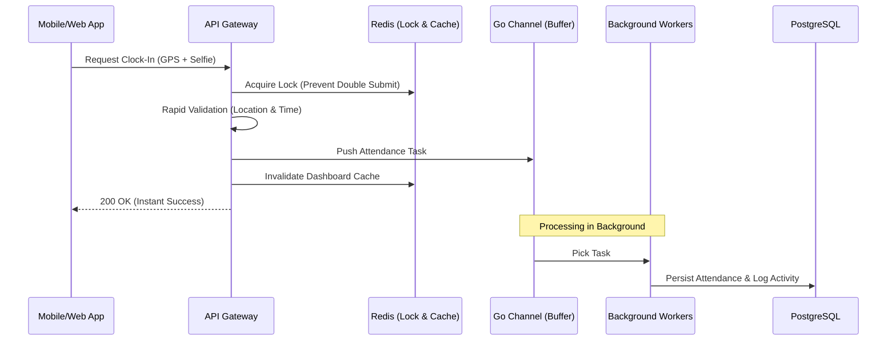
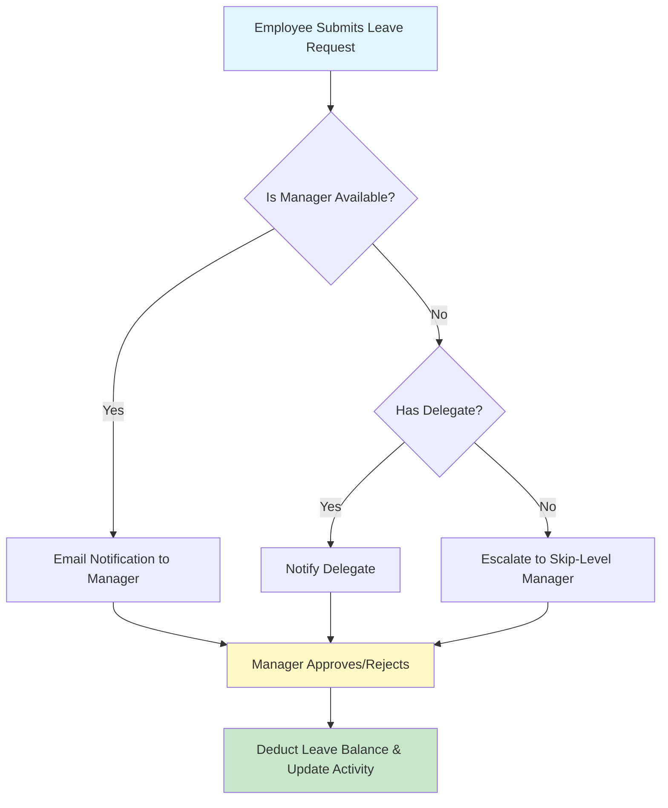

# Attendance API: Enterprise-Grade Workforce Management 🚀

Welcome to the future of workforce management. Our **Go-Attendance API** is a high-availability, multi-tenant SaaS platform designed to streamline human resource operations, from real-time attendance tracking to complex hierarchical leave approvals.

---

## 🏗️ Core Value Proposition

This system is built for scalability and transparency. Whether you are a small startup or a massive enterprise with thousands of employees, our architecture ensures zero downtime during peak hours and complete data isolation between organizations.

### Key Pillars:
1.  **Multi-Tenant Isolation**: Total data separation between different companies.
2.  **RBAC 2.0 (Role-Based Access Control)**: Custom roles with granular permissions.
3.  **High-Traffic Resilience**: Redis-backed concurrency handling for peak check-in times.
4.  **Hierarchical Intelligence**: Automatic approval routing based on your organization chart.

---

## 🔄 Lifecycle Workflows

### 1. Tenant Onboarding & Setup
When a company (Tenant) subscribes, they define their organizational strata and reporting lines.

### 2. High-Performance Attendance (Peak Hour Flow)
To ensure the server never crashes when 5,000 employees clock in at 08:00 AM, we use an asynchronous buffering strategy.

### 3. Intelligent Leave & Overtime Approval
Our system understands your organization. If your direct manager is on leave, the system intelligently escalates the request to the next superior or a designated delegate.

---

## 📊 Analytics & Transparency

Our dashboards are not just static numbers; they are **accountable data points**. 

*   **Activity Heatmaps**: Identify presence density across the week.
*   **Leave Seasonality**: Compare Planned vs. Unplanned leave to predict workforce shortages.
*   **Performance Matrix**: Automatically score employees based on punctuality and reliability.
*   **Drill-Down Transparency**: Click any chart to see exactly which employees (with their department and performance score) contribute to that metric.

---

## 🔒 Security & Performance Standards

*   **HMAC Signatures**: Every request is signed to prevent tampering between the Frontend Proxy and the Backend.
*   **Redis Mutex**: Distributed locking prevents "Race Conditions" where a user might accidentally double-clock.
*   **Audit Logs**: Every sensitive action (Role change, Approval, User Creation) is recorded in the `RecentActivity` log.
*   **Professional Notifications**: Beautifully designed HTML emails for all critical workflows ensures your brand looks professional to your employees.

---

## 🚀 Get Started Today

Our API is fully documented with **Swagger/OpenAPI**, making it incredibly easy for your internal developers to integrate into your existing ERP or Mobile Apps.

**Elevate your HR operations with a backend that never sleeps and never slows down.**
