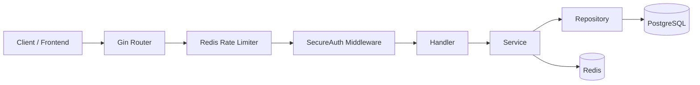

# Go Attendance API


Go Attendance API is a multi-tenant HR and attendance backend built with Go. It covers authentication, employee management, attendance, leave, overtime, payroll, dashboards, timesheets, finance, performance, subscriptions, support desk workflows, and platform administration.

The API is built with Gin, GORM, PostgreSQL, and Redis. Tenant data is isolated through request context, while feature access is controlled through roles, base roles, permissions, and subscription plan features.

## Table of Contents

- [Main Features](#main-features)
- [Architecture Overview](#architecture-overview)
- [Project Structure](#project-structure)
- [System Requirements](#system-requirements)
- [Environment Variables](#environment-variables)
- [Running the Project](#running-the-project)
- [Database, Migration, and Seeder](#database-migration-and-seeder)
- [Swagger](#swagger)
- [Authentication and Security Headers](#authentication-and-security-headers)
- [Main Endpoints](#main-endpoints)
- [Testing and Development Tools](#testing-and-development-tools)
- [Troubleshooting](#troubleshooting)

## Main Features

- Multi-tenant HR system with tenant-level data isolation.
- JWT authentication through an HTTP-only session cookie.
- RBAC with roles, base roles, permissions, and hierarchy support.
- Attendance tracking with Redis locking, cache invalidation, and GPS/time validation.
- Leave and overtime request flows with approval actions.
- Payroll calculation, payroll profiles, payslips, baseline data, and attendance sync.
- Admin, HR, finance, heatmap, daily pulse, and employee DNA dashboards.
- Organization chart, positions, tenant roles, and role hierarchy management.
- HR operations: shifts, roster, holiday calendar, and employee lifecycle.
- Timesheets, projects, tasks, and employee reports.
- Finance expense and quota management.
- Performance goals, cycles, appraisals, and self reviews.
- Subscription plans, tenant subscriptions, reminders, suspension, and upgrades.
- Support desk, trial requests, and tenant provisioning.
- Media upload through ImgBB.
- Transactional email through Resend.
- Swagger documentation for API exploration.

## Architecture Overview

### Request Lifecycle



Main layers:

- `handler`: parses HTTP requests, binds payloads, and returns responses.
- `service`: contains business logic, orchestration, security checks, and workflows.
- `repository`: handles database access and queries.
- `model`: contains GORM entities and request/response models.
- `middleware`: handles authentication, permissions, tenant context, anti-replay checks, and rate limiting.
- `seeder`: provides initial tenants, roles, permissions, demo users, plans, and sample data.

### Multi-Tenant Flow

After login, the API returns a session cookie named `access_token`. On protected routes, the middleware resolves the user from the token, checks tenant status, role, permissions, and plan features. The tenant ID is then injected into the request context so GORM queries can be scoped to the current tenant.

Superadmin users bypass tenant scoping with `tenant_id = 0`, allowing platform-level access across tenants.

### Attendance Flow

Attendance uses Redis to prevent duplicate requests and race conditions. The service performs quick validations, stores the attendance record, writes a recent activity entry, and invalidates related attendance/dashboard cache keys.

## Project Structure

```text
go-attendance-api/
├── cmd/
│   └── api/
│       └── main.go                  # Application entry point
├── docs/                            # Generated Swagger files
├── internal/
│   ├── config/                      # Database, Redis, tenant plugin
│   ├── dto/                         # Module-specific DTOs
│   ├── handler/                     # HTTP handlers
│   ├── middleware/                  # Auth, RBAC, tenant, rate limit
│   ├── model/                       # GORM models and request models
│   ├── repository/                  # Database access layer
│   ├── routes/                      # Route registration per module
│   ├── seeder/                      # Initial data for development/demo
│   ├── service/                     # Business logic
│   └── utils/                       # Response helpers, email, logger, preload
├── .air.toml                        # Hot reload config
├── docker-compose.yaml              # App, PostgreSQL, Redis
├── Dockerfile                       # Multi-stage Docker build
├── go.mod
├── go.sum
└── readme.md
```

## System Requirements

- Go `1.26.1`, or the version defined in `go.mod`.
- PostgreSQL 16 or compatible.
- Redis 7 or compatible.
- Docker and Docker Compose if running with containers.
- `swag` CLI if you need to regenerate Swagger docs locally.
- Air if you want hot reload during development.

Optional development tools:

```bash
go install github.com/swaggo/swag/cmd/swag@latest
go install github.com/air-verse/air@latest
```

## Environment Variables

Copy the example environment file:

```bash
cp .env.example .env
```

Main variables:

| Variable | Example | Description |
| --- | --- | --- |
| `APP_PORT` | `8085` | HTTP port used by the API. |
| `APP_ENV` | `development` | When set to `development`, anti-replay and internal secret checks are bypassed. |
| `DB_HOST` | `127.0.0.1` | PostgreSQL host for local runs. Use `db` in Docker Compose. |
| `DB_PORT` | `5432` | PostgreSQL port from the application perspective. |
| `DB_USER` | `postgres` | PostgreSQL username. |
| `DB_PASSWORD` | `1234` | PostgreSQL password. |
| `DB_NAME` | `attendance-db` | PostgreSQL database name. |
| `REDIS_ADDR` | `127.0.0.1:6379` | Redis address. Use `redis:6379` in Docker Compose. |
| `REDIS_PASSWORD` | empty | Redis password, if enabled. |
| `JWT_SECRET` | `change-me` | Secret used to sign JWT tokens. Required for login. |
| `INTERNAL_SECRET` | `change-me` | Expected `X-Internal-Secret` value for production protected routes. |
| `SIGN_SECRET` | `change-me` | Secret used to validate `X-Signature` in production. |
| `FRONTEND_URL` | `http://localhost:3000` | Frontend URL used for password reset links. |
| `IMGBB_API_KEY` | empty | API key for ImgBB media uploads. |
| `RESEND_API_KEY` | empty | Resend API key for transactional email. |
| `RESEND_FROM_EMAIL` | `noreply@example.com` | Sender email used by Resend. |
| `RUN_MIGRATION` | `true` | Runs GORM AutoMigrate on application startup. |
| `RUN_SEEDER` | `false` | Runs seeders on application startup. |
| `RESET_DB` | `false` | Drops tables and runs migration again. Use carefully. |

Notes:

- `.env.example` does not currently include all security variables such as `JWT_SECRET`, `APP_ENV`, `INTERNAL_SECRET`, `SIGN_SECRET`, and `FRONTEND_URL`. Add them manually to `.env` when needed.
- Login cookies are configured with `Secure: true`, so browsers only send them over HTTPS. For local API testing through Postman or curl, capture the cookie from the login response and send it back with the `Cookie` header.

## Running the Project

### Option 1: Local Development

Make sure PostgreSQL and Redis are running locally.

Example local `.env`:

```env
APP_ENV=development
APP_PORT=8085

DB_HOST=127.0.0.1
DB_PORT=5432
DB_USER=postgres
DB_PASSWORD=1234
DB_NAME=attendance-db

REDIS_ADDR=127.0.0.1:6379
REDIS_PASSWORD=

JWT_SECRET=local-jwt-secret
INTERNAL_SECRET=local-internal-secret
SIGN_SECRET=local-sign-secret
FRONTEND_URL=http://localhost:3000

RUN_MIGRATION=true
RUN_SEEDER=true
RESET_DB=false
```

Install dependencies and start the server:

```bash
go mod download
go run ./cmd/api/main.go
```

Run with hot reload:

```bash
air
```

The server runs at:

```text
http://localhost:<APP_PORT>
```

Simple health check:

```bash
curl http://localhost:8085/api/v1/ping
```

### Option 2: Docker Compose

Make sure `.env` exists, then run:

```bash
docker compose up -d --build
```

Created services:

| Service | Container | Host Port | Container Port |
| --- | --- | --- | --- |
| App | `attendance-api` | `${APP_PORT:-8080}` | `${APP_PORT:-8080}` |
| PostgreSQL | `attendance-db` | `5433` | `5432` |
| Redis | `attendance-redis` | `6380` | `6379` |

Useful commands:

```bash
docker compose logs -f app
docker compose ps
docker compose down
```

Remove containers and database volume:

```bash
docker compose down -v
```

## Database, Migration, and Seeder

Migration uses `db.AutoMigrate` in `internal/config/database.go`.

When `RUN_MIGRATION=true`, the application will:

1. Create the PostgreSQL `uuid-ossp` extension.
2. Run staged migrations based on model dependencies.
3. Seed the base subscription plans.
4. Backfill tenants that do not have a subscription yet.
5. Backfill users that do not have payroll profiles yet.
6. Enable the GORM tenant plugin.

When `RUN_SEEDER=true`, the application will create demo data:

- System tenant and sample tenants.
- Roles and permissions.
- Role hierarchy.
- Positions.
- Demo users.
- Tenant settings.
- Recent activities.
- Projects.
- Leave data.
- Attendance history.
- Overtime data.
- Support data.
- Payroll profiles.

Demo accounts from the seeder:

| Role | Email | Password |
| --- | --- | --- |
| Super Admin | `superadmin@yopmail.com` | `123456` |
| Tenant Admin | `admin@friendship.com` | `123456` |
| HR | `hr@friendship.com` | `123456` |
| Finance | `finance@friendship.com` | `123456` |
| Employee | `employee@friendship.com` | `123456` |

Reset the database:

```env
RESET_DB=true
RUN_MIGRATION=true
RUN_SEEDER=true
```

Use `RESET_DB=true` only for development because the database tables are dropped with `CASCADE`.

## Swagger

Swagger is available at:

```text
http://localhost:<APP_PORT>/swagger/index.html
```

Swagger routes are only registered when Gin is not running in `release` mode. Docker Compose sets `GIN_MODE=release`, so Swagger is not available there by default.

Regenerate Swagger:

```bash
swag init -g cmd/api/main.go
```

Generated files are stored in `docs/`.

## Authentication and Security Headers

Public routes:

- `POST /api/v1/auth/register`
- `POST /api/v1/auth/login`
- `POST /api/v1/auth/forgot-password`
- `POST /api/v1/auth/reset-password`
- `POST /api/v1/public/trial-request`
- `GET /api/v1/ping`
- `POST /api/v1/email/test`

Protected routes require this cookie:

```http
Cookie: access_token=<jwt>
```

When `APP_ENV` is not `development`, protected routes also require:

```http
X-Timestamp: <unix milliseconds>
X-Request-ID: <unique request id>
X-Internal-Secret: <INTERNAL_SECRET>
X-Signature: <hmac sha256>
```

`X-Signature` is generated from the request body, timestamp, and request ID using `SIGN_SECRET`. See `docs/anti_replay_mechanism.md` for the detailed anti-replay mechanism.

Login example:

```bash
curl -i -X POST http://localhost:8085/api/v1/auth/login \
  -H "Content-Type: application/json" \
  -d "{\"email\":\"admin@friendship.com\",\"password\":\"123456\",\"device_info\":\"Local curl\"}"
```

Protected request example:

```bash
curl http://localhost:8085/api/v1/users/me \
  -H "Cookie: access_token=<token-from-login>"
```

## Main Endpoints

Base path:

```text
/api/v1
```

Module summary:

| Module | Prefix | Description |
| --- | --- | --- |
| Auth | `/auth` | Register, login, logout, sessions, password flows. |
| Attendance | `/attendance` | Clock in/out, history, summary, today, corrections. |
| Users | `/users`, `/employees` | Profile, employee list, user creation, change requests. |
| Media | `/media/upload` | Media upload to ImgBB. |
| Dashboard | `/dashboards` | Admin, HR, finance, and heatmap dashboards. |
| Leave | `/leaves` | Leave requests, history, balances, approve/reject. |
| Overtime | `/overtime` | Overtime requests and approval flow. |
| Tenant | `/tenants`, `/tenant-setting` | Tenant and tenant setting management. |
| Organization | `/organization` | Organization chart and positions. |
| Tenant Role | `/tenant-roles` | Tenant roles, permissions, and hierarchy. |
| Payroll | `/payroll`, `/my-payroll` | Payroll calculation, generation, slips, profiles. |
| HR Ops | `/hr` | Shifts, roster, calendar, lifecycle. |
| Timesheet | `/timesheet`, `/projects` | Entries, tasks, projects, reports. |
| Finance | `/finance` | Expenses, summaries, quotas. |
| Performance | `/performance` | Goals, cycles, appraisals. |
| Subscription | `/subscriptions`, `/superadmin/subscriptions`, `/superadmin/plans` | Plans and subscriptions. |
| Support | `/support/message`, `/admin/support` | Support messages, trials, provisioning. |
| Superadmin | `/superadmin` | Analytics, tenant updates, platform accounts, system roles. |
| Activities | `/activities` | Recent activities and quick info. |

Use Swagger for detailed request bodies, responses, and authorization rules.

## Response Format

Successful response:

```json
{
  "success": true,
  "meta": {
    "message": "Data fetched successfully",
    "code": 200,
    "status": "success",
    "pagination": {
      "total": 100,
      "per_page": 10,
      "current_page": 1,
      "last_page": 10
    }
  },
  "data": {}
}
```

Error response:

```json
{
  "success": false,
  "meta": {
    "message": "Invalid request",
    "code": 400,
    "status": "error"
  },
  "data": "error detail"
}
```

## Testing and Development Tools

Run tests:

```bash
go test ./...
```

Build binary:

```bash
go build -o ./tmp/main.exe ./cmd/api/main.go
```

Format code:

```bash
gofmt -w ./cmd ./internal
```

Regenerate Swagger:

```bash
swag init -g cmd/api/main.go
```

## Development Notes

- Do not hardcode tenant filters in handlers. Use the tenant context and the existing repository/service patterns.
- Register new endpoints through the appropriate file in `internal/routes/`.
- Keep business logic in `internal/service/`, not in handlers.
- Keep database queries in `internal/repository/`.
- Use response helpers from `internal/utils/response.go`.
- Protect routes with `RequireRole`, `RequireBaseRole`, `HasPermission`, or `RequireTenant` as needed.
- For optional relationship loading, follow the existing `includes` helper pattern.
- After updating Swagger annotations, run `swag init -g cmd/api/main.go`.

## Troubleshooting

### Login fails with `JWT secret not configured`

Add `JWT_SECRET` to `.env`, then restart the server.

### Protected route returns `Missing Session`

Protected routes read the token from the `access_token` cookie. Send the cookie returned by the login endpoint in subsequent requests.

### Protected route returns `Invalid Internal Secret` or `Request expired`

Set `APP_ENV=development` for local development, or send the complete production security headers.

### Swagger is not available when using Docker Compose

Docker Compose runs the app with `GIN_MODE=release`, and Swagger routes are only enabled outside release mode. Run the app locally without release mode or change the Docker environment for development.

### Demo data is not inserted

Make sure these variables are enabled:

```env
RUN_MIGRATION=true
RUN_SEEDER=true
```

If the database already contains data, some seeders intentionally skip existing records.

### Redis connection error

For local runs, make sure Redis is running at `REDIS_ADDR`. For Docker Compose, the app uses `REDIS_ADDR=redis:6379` inside the Docker network.

### PostgreSQL connection error

For local runs, use your local PostgreSQL port. For Docker Compose, the app uses `DB_HOST=db` and `DB_PORT=5432`; from the host machine, the PostgreSQL container is exposed on port `5433`.

## Additional Documentation

- `docs/anti_replay_mechanism.md`: anti-replay mechanism details.
- `product-documentation.md`: product documentation.
- `INSTRUCTION.md`: project instruction notes.

## License

This project is licensed under the MIT License.
