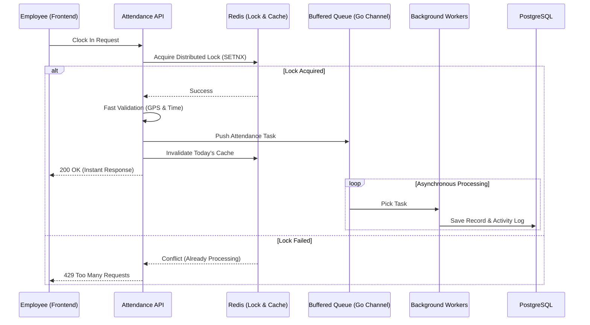
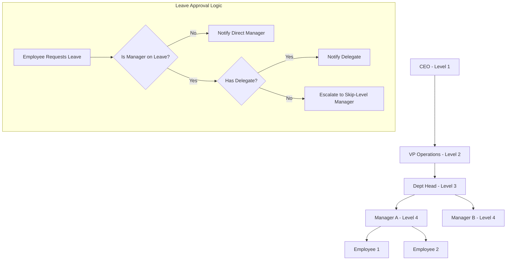

# Go Attendance API


A robust, enterprise-grade attendance management system built with Go. This API is designed for high-availability, featuring multi-tenant support, hierarchical organization structures, and optimized for high-traffic peak hours using advanced concurrency patterns.

## 🏗️ System Architecture & Workflow

### 1. High-Traffic Attendance Processing
To handle thousands of employees clocking in simultaneously during peak hours (e.g., 08:00 AM), the system employs a **Buffered Queue & Background Worker** strategy. This ensures the database never becomes a bottleneck and prevents server crashes.



### 2. Organizational Hierarchy & Leave Workflow
The system supports complex N-level organizational trees (CEO → VP → Head → Manager → Employee). It features intelligent leave approval routing with automatic escalation.



---

## 🚀 Key Features

-   **High-Concurrency Performance**: Uses Redis Distributed Locks to prevent race conditions and Go Channels for background DB persistence.
-   **Advanced Organization Tree**: Dynamic Org Chart support with job strata levels and reporting lines.
-   **Smart Leave Management**: 
    - Automatic approval routing based on hierarchy.
    - Temporary task delegation during leave.
    - Professional, responsive email templates for notifications.
-   **Multi-Tenancy**: Complete data isolation between different companies/tenants.
-   **Security**: JWT-based authentication, RBAC (Role-Based Access Control), and GPS-fencing for attendance.

---

## 🛠️ Technologies Used

-   **Backend**: Go (Gin Gonic), GORM (PostgreSQL).
-   **Caching/Concurrency**: Redis (Distributed Locking, Write-Behind Caching).
-   **Worker Pool**: Custom Goroutine-based worker pool for async task execution.
-   **Infrastructure**: Docker & Docker Compose.
-   **Communication**: Resend API for transactional emails with centralized HTML templates.

---

## 📂 Project Structure

```
go-attendance-api/
├── cmd/api/main.go           # Entry point & dependency injection
├── internal/
│   ├── handler/              # Controller layer (HTTP parsing)
│   ├── service/              # Business logic (Concurrency & Queue logic)
│   ├── repository/           # Data access (PostgreSQL & Redis)
│   ├── model/                # GORM entities & Org Tree nodes
│   └── utils/                # Email templates & response helpers
├── docs/                     # Swagger UI documentation
└── ...
```

---

## 🏁 Getting Started

### Prerequisites
-   Go 1.26+
-   Docker & Docker Compose
-   Redis 7.0+

### Setup
1.  **Clone & Configure**:
    ```bash
    cp .env.example .env.local
    # Set your JWT_SECRET and REDIS_ADDR
    ```
2.  **Spin Up Environment**:
    ```bash
    docker-compose up -d --build
    ```
3.  **Access Documentation**:
    Open `http://localhost:8080/swagger/index.html` to explore the API.

---

## 📄 API Rules & Guidelines

1.  **Response Format**: All responses follow a standardized `APIResponse` with a `meta` object containing pagination and status.
2.  **Concurrency**: Never perform heavy DB writes inside the main request context for attendance; always use the `recordQueue`.
3.  **Preloading**: Use the `includes` query parameter to fetch relationships (e.g., `?include=user,position`).

## 🤝 Contributing
Please follow the [Commit Message Strategy](#commit-message-strategy) for all PRs.

## 📜 License
This project is licensed under the MIT License.
